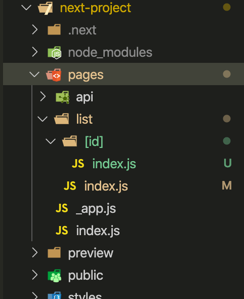

This is a [Next.js](https://nextjs.org/) project bootstrapped with [`create-next-app`](https://github.com/vercel/next.js/tree/canary/packages/create-next-app).

## 1. Getting Started

First, run the development server:

```bash
npm run dev
# or
yarn dev
```

Open [http://localhost:3000](http://localhost:3000) with your browser to see the result.

### 2. next 文件即路由

在pages文件目录下建立list文件，哪些路由就是`localhost:3000/list`

如果要生成 `http://localhost:3000/list/:id`路由有两种方式

1. 在`list`目录下添加一个动态目录即可`[id]`

    

2. 自定义`server.js`
修改启动脚本

    ```javascript
    "scripts": {
        "dev": "node server.js"
    },
    ```

* 如下

```javascript
const { createServer } = require('http')
const { parse } = require('url')
const next = require('next')

const dev = process.env.NODE_ENV !== 'production'
const app = next({ dev })
const handle = app.getRequestHandler()

app.prepare().then(() => {
  createServer((req, res) => {
  
    const parsedUrl = parse(req.url, true)
    const { pathname, query } = parsedUrl

    if (pathname === '/a') {
      app.render(req, res, '/b', query)
    } else if (pathname === '/b') {
      app.render(req, res, '/a', query)
    } else {
      handle(req, res, parsedUrl)
    }
  }).listen(3000, err => {
    if (err) throw err
    console.log('> Ready on http://localhost:3000')
  })
})
```

### 3.getInitialProps中初始化数据

```javascript
import React, { Component } from 'react'
import Comp from '@components/pages/index'
import { AppModal, CommonModel } from '@models/combine'

interface IProps {
  router: any
}
class Index extends Component<IProps> {
  static async getInitialProps(ctx) {
    const { req } = ctx
    try {
      // xxxx 获取数据
    } catch (e) {
      console.log(e)
    }
  }
  render() {
    return <Comp />
  }
}

export default Index
```

如果项目中用到了Redux，那么，接口获得的初始化数据需要传递给ctx.req，从而在前台初始化Redux时，才能够将初始数据带过来！！

### 4. _app.js

统一布局处理，错误处理

+ 页面布局
+ 当路由变化时保持页面状态
+ 使用componentDidCatch自定义处理错误

```javascript
import React from 'react'
import App, { Container } from 'next/app'
import Layout from '../components/Layout'
import '../styles/index.css'

export default class MyApp extends App {

    componentDidCatch(error, errorInfo) {
        console.log('CUSTOM ERROR HANDLING', error)
        super.componentDidCatch(error, errorInfo)
    }

    render() {
        const { Component, pageProps } = this.props
        return (
            <Container>
                <Layout>
                    <Component {...pageProps} />
                </Layout>
            </Container>)
    }
}
```